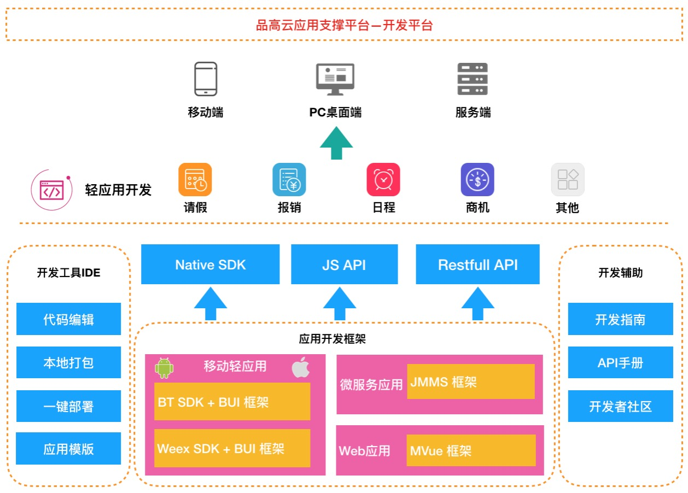

# 概述

> 面对企业不断递增、变化的信息化需求，要求应用支撑平台具备丰富的扩展能力以及快速开发的能力。《品高云应用支撑平台》中的《开发平台》提供了一系列 框架、工具、文档，帮助开发者快速开发业务应用。平台支持开发移动轻应用、PC端网页轻应用、微服务，它是一个《全栈轻应用开发平台》。这里的轻应用是指运行在平台之上，提供细分业务服务的轻量级应用，例如Link平台应用市场里面的业务应用。

# 架构

本书由浅及深主要包括如下几个方面：

# 场景

从开发商接入角度，阐述使用场景、涉及到的技术方案，提供最佳实践的实现思路。

# 开发工具

介绍 LinkIDE（全栈轻应用开发工具) 的使用。它主要面向前端开发人员，支持开发移动轻应用、PC端网页轻应用、微服务。提供开发、调试、打包、部署等能力。

#### 平台集成

对接 [Link企业社交化协作平台](https://www.bingolink.biz/)，IDE开发出来的轻应用可以上架到Link平台，并使用Link平台的原生能力；对接交付平台，IDE中有入口可以进行项目管理、应用管理、程序包管理。程序包部署可以通过IDE进行一键交付到开发测试云。

#### 开发调试

内置editor提供舒适的代码编辑感受，配合丰富的代码片段，开发人员只需要记住几个关键字即可快速查到组件、API接口。 IDE中集成四种框架的开发调试模式，都是基于标准的 Chrome 调试协议。

#### 本地打包

在具备 android,iOS 的编译环境的前提下，前端开发人员可以快速打包 ipa 和 apk。支持端设置、证书管理、编译管理等。

#### 一键交付

与交付平台对接，支持将移动轻应用交付到 Link平台、将PC网页应用和微服务交付到 开发测试云。

# 应用开发框架

#### WebApp框架 (BingoTouch SDK + BUI)

基于标准的 html5,css3,js技术开发跨平台的移动应用，原生层面基于 BingoTouch 框架(BT SDK) 提供调用原生功能的接口，UI层面基于BUI框架。

#### 小程序框架 (Weex SDK + BUI-Weex)

基于 Vue, Weex 跨平台渲染引擎，具备趋近于WebApp开发体验的技术方案（渲染出来的是原生View），同样具备跨平台能力，UI层面基于 BUI-Weex 框架。

#### 微服务框架（JMMS）

基于 Spring Boot、LeapFramework 构建的微服务框架，开发者可以使用动态语言（java）和脚本（ js, sql）开发标准的 Restfull API。如脚本无法满足开发要求，框架也支持集成 Spring Cloud 的方式进行微服务开发。

#### Web应用框架（MVue）

基于 Vue，IView 等框架构建 Web轻应用、控制台应用。 配合使用 JMMS 微服务框架，开发人员可以快速构建 前后端分离的Web应用。