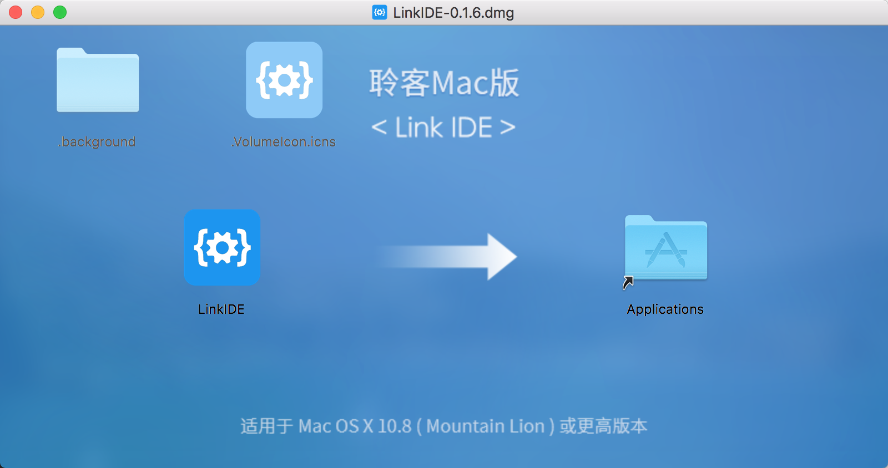

## 安装

最新版本下载（0.1.16）
[windows](http://pan.bingosoft.net:81/drive/share/open_sharepage/dffc8e4c-5cff-4ba7-9d84-f3253475d86c:bingo) 、 [mac](http://pan.bingosoft.net:81/drive/share/open_sharepage/c61a6f90-b676-4ecd-81a1-9435091884fe:bingo)

### 依赖

初次安装 IDE，需要安装相关依赖

| 名称 | 类型 | 下载 |  描述|
| ---- |:----:|:---:|:----------:|
| **`nodejs `** | `运行环境` | [win](https://nodejs.org/dist/v8.10.0/node-v8.10.0-x86.msi) 、[mac](https://nodejs.org/dist/v8.10.0/node-v8.10.0.pkg) | |
| **`jdk `** | `运行环境` | [JDK](http://www.oracle.com/technetwork/java/javase/downloads/index.html) | JDK8+ 暂不支持JDK9 | 
| **`cnpm `** | `package` |  | 包管理工具 |
| **`mvn `** | `package` |  | Maven java包管理工具 | 
| **`jmms`** | `package` |  | 微服务框架工具 |

####自动安装

IDE会在界面提示开发者，手工安装完 nodejs,jdk后，点击 "安装"即可，如下图：


####手工安装

1.安装完 nodejs 运行环境后，需要安装 cnpm 包管理命令：(同时切换到淘宝源）

```
npm install cnpm -g –registry=https://registry.npm.taobao.org 
```

2.将 package 安装到全局，过程可能比较久，请耐心安装完

```
cnpm i -g mvn jmms

```
如遇 `Error: EACCES: permission denied` ,请在命令前面加上 `sudo` 

```
sudo cnpm i -g mvn jmms

```

### Win下安装

双击 exe 文件，程序将自动启动安装过程，同时在桌面生成快捷方式，将会自动安装到如下路径：

```
C:\Users\***\AppData\Local\linkide
```


### Mac下安装

双击 dmg 文件，将 LinkIDE 拖放到 Application 即可




