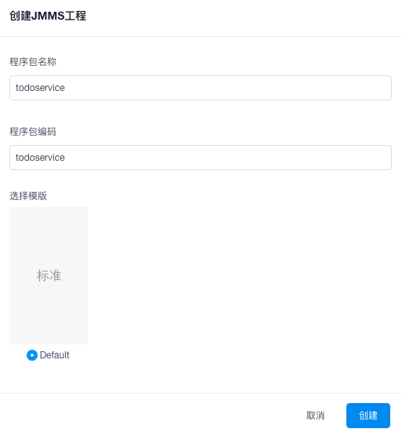
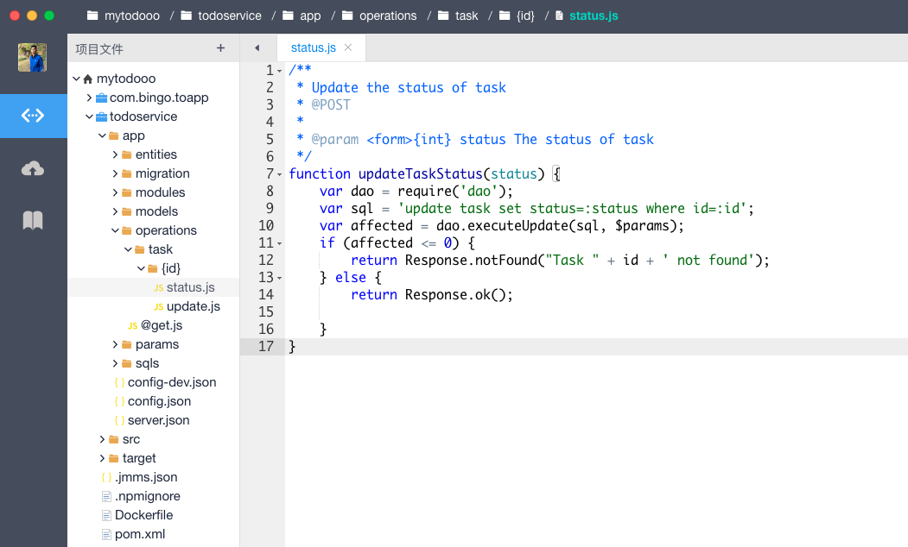
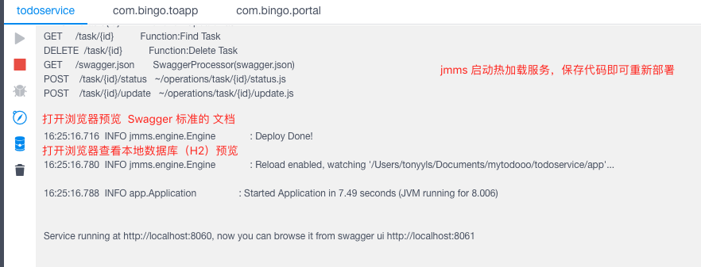
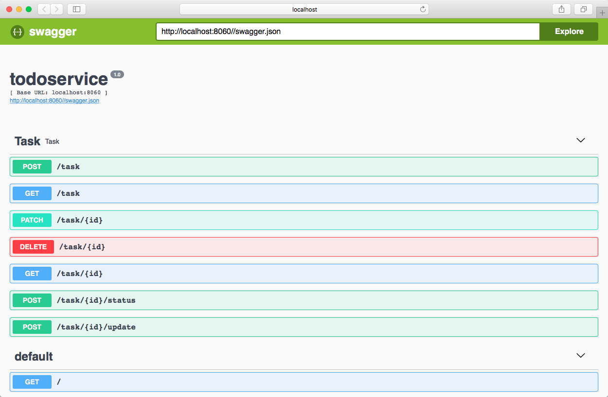
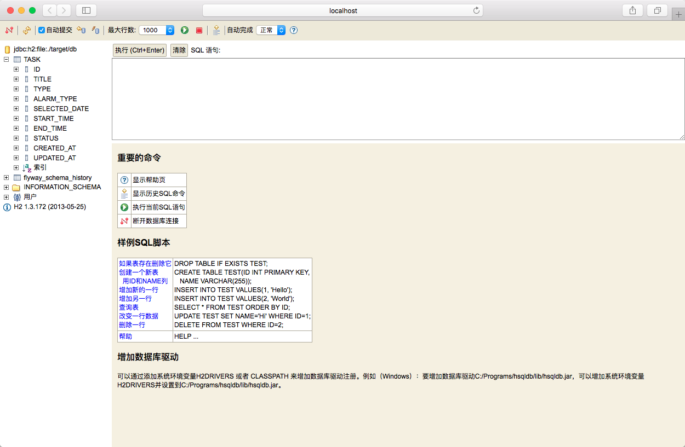

## 微服务开发

微服务开发，基于平台提供的 [jmms](https://jmms-doc.github.io/) 框架，使用动态语言(`java`)和脚本(`js`,`sql`)开发标准的`Restfull API`。

### 创建

### 编码

微服务的开发，可以基于 `js`,`sql`,`java` ，具体请看[开发文档](https://jmms-doc.github.io/)

### 运行服务

点击IDE 右下角【控制台】，选择对应的程序包工程

### 查看接口文档

IDE自动生成 Swagger 标准文档

### 查看本地数据库

IDE自动生成 H2 控制台

