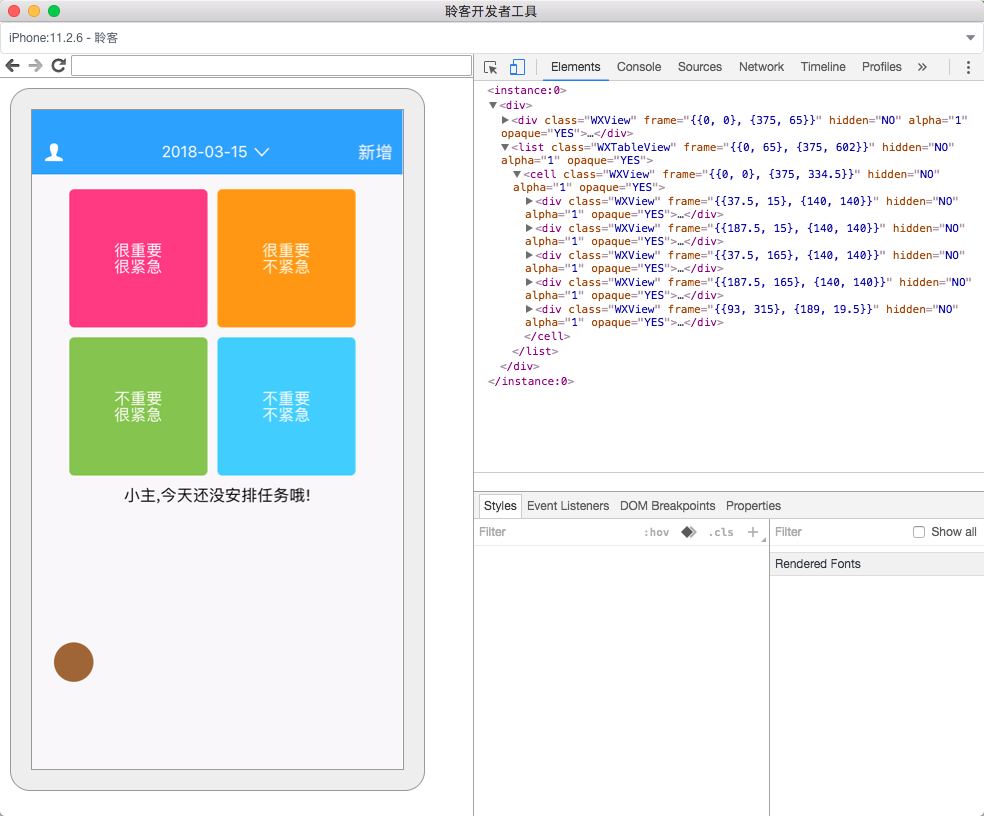

## 小程序开发

移动端轻应用，其中一种是小程序，它是基于 [weex](https://weex-project.io/) 框架，使用前端技术构建的轻应用。与webapp不同，它最后构建出来是原生的组件。

平台提供 [BUI-Weex](http://dev.bingocc.com/buiweex/) 框架帮助开发者快速开发小程序。

### 创建

### 编码

小程序页面开发，基于 [Vue.js](https://vuejs.org/) 框架

### 运行

点击IDE 右下角【控制台】，选择对应的程序包工程

### 调试

手机端Link进入 “我”》“小程序调试”,扫描 IDE 右下角的二维码

此时，Link手机端将会和 IDE建立连接，点击 “调试”按钮，即可打开调试窗口

该窗口可以帮助开发人员快速查看页面结构以及输出的`log`，目前手机上的部分效果无法在该窗口显示，以手机上真实效果为准。