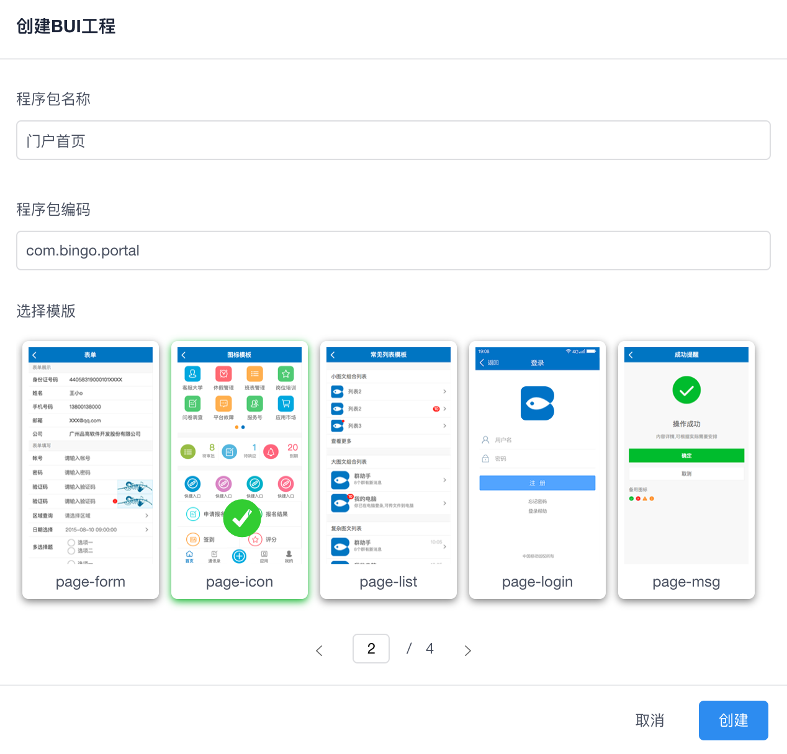
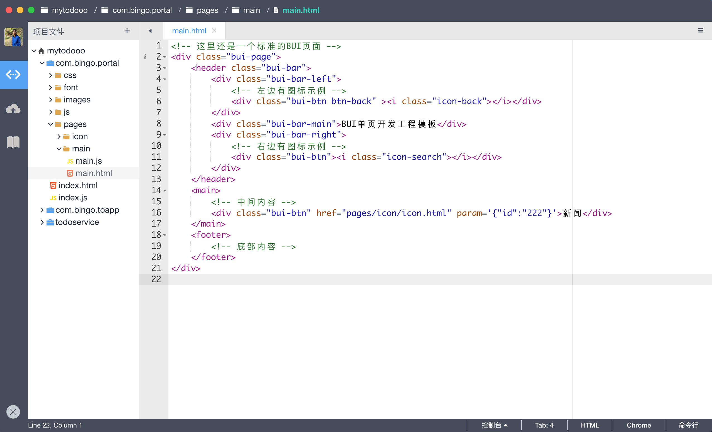
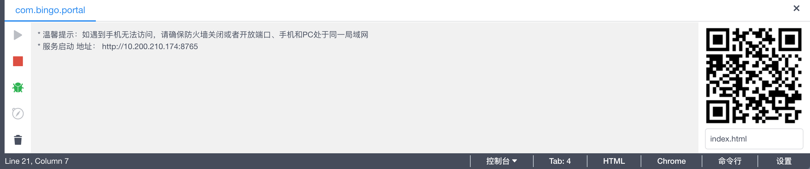
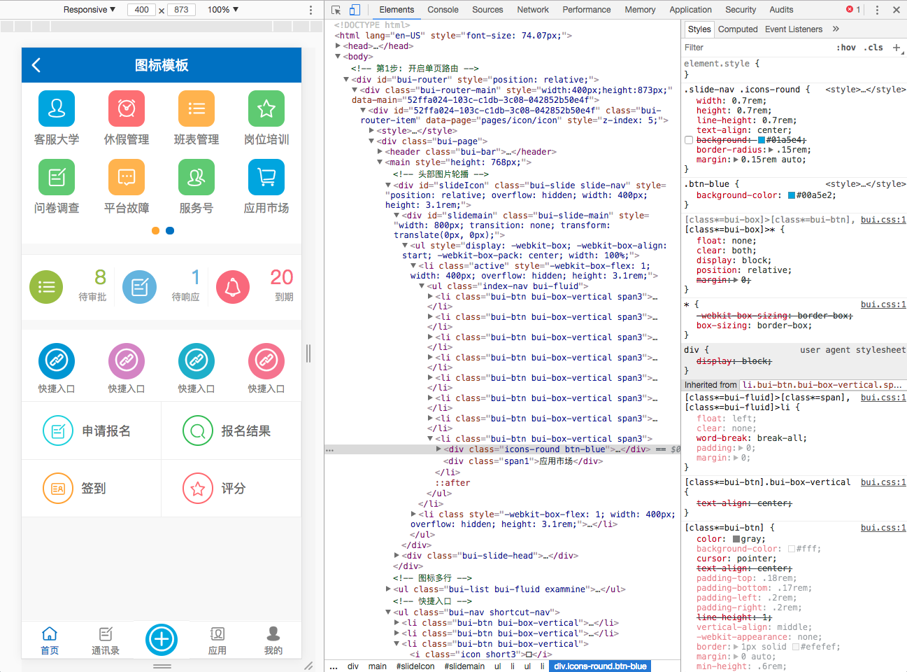
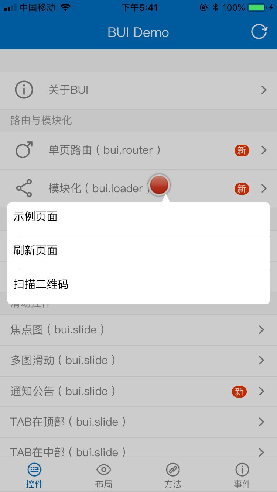
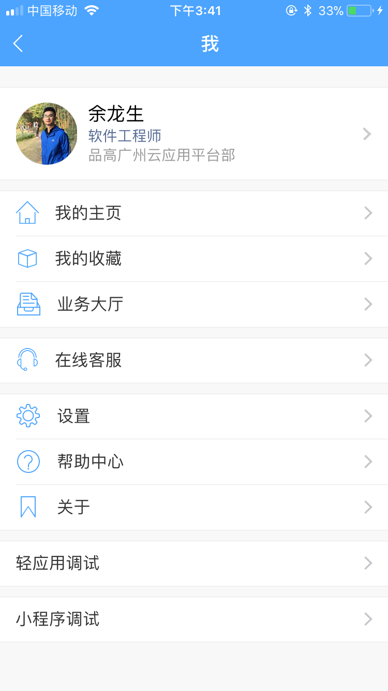
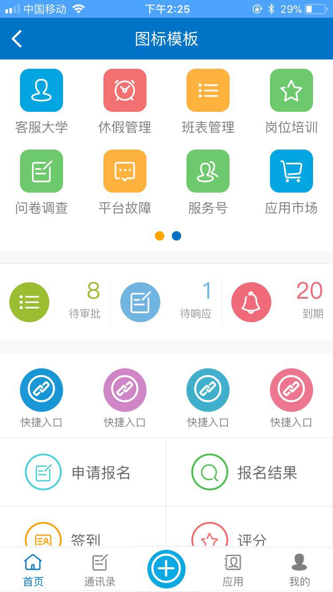

# 移动轻应用开发-BingoTouch

BingoTouch(简称BT)是基于Cordova之上的 WebApp运行引擎，它提供了js与native通讯的能力，BT中包含了 `100+` js接口。开发者使用标准的 Html5,CSS3,JS 技术构建的轻应用页面，这些页面运行在 BT 容器之上。同时，平台提供 [BUI](http://www.easybui.com/) 框架帮助开发者快速开发WebApp。

| UI框架 | JSSDK | 文档 | 调试工具 | 
| :----: |:----:|:----:|:----:|
| [BUI](http://www.easybui.com/) | [BT SDK](https://github.com/bingo-oss/mobile-btjsapi) | [Docs](http://dev.bingocc.com/btapi/v1.0.0/index.html) | [Android](http://pan.bingosoft.net:81/drive/share/open_sharepage/6a65e80a-9677-48ff-9762-866a06f566a4:bingo) [iOS](http://pan.bingosoft.net:81/drive/share/open_sharepage/e3cb6eec-0629-417c-9b3f-efd787c5d940:bingo) |

应用开发流程： 创建 >  编码 > 运行 > 调试 > 打包

## 创建

## 编码

基于标准的 html5,css3,js 编写标准的 webapp 程序

## 运行

IDE 将会启动静态服务器装载程序，同时生成二维码，可以使用调试工具扫描查看页面。

## 调试

UI界面开发借助 Chrome的DevTool，在IDE中可以直接打开。

调试的思路： DebTool或者Link 扫描生成的二维码

### 使用DebugTool工具

下载 DebgTool，安装到手机上即可调试页面。

### 使用Link调试

手机端Link进入 “我”》“轻应用调试”,扫描 IDE 右下角的二维码

