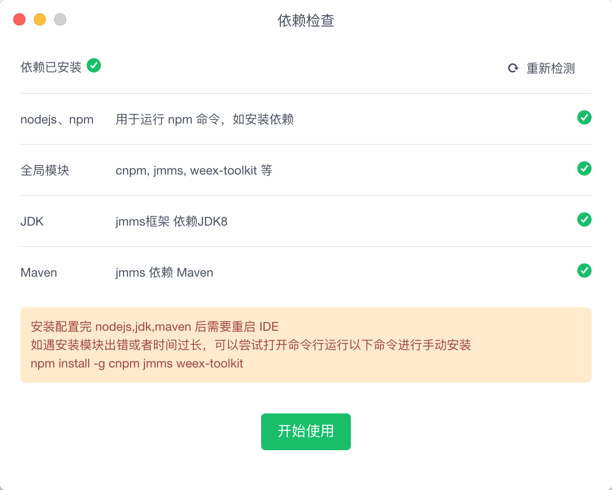

# 安装运行

LinkIDE 支持运行在 `OS X 10.8 +` `Win7 + `。

## 下载
| 版本 | 安装包 | 发布日期 | 说明 | 
| :----: |:----:|:----:|:---:|
| 1.0.0beta | [下载](http://pan.bingosoft.net:81/drive/share/open_sharepage/8f3536f9-5902-4b03-8792-b56dc8a68703:bingo) | 2018-7-1 | 公测版本 |

## 依赖

初次运行，IDE会检测当前系统是否具备下述依赖，请根据提示进行安装！这些依赖包括：

| 名称 | 类型 | 下载 |  描述|
| ---- |:----:|:---:|:----------:|
| **`node `** | `运行环境` | [win](https://nodejs.org/dist/v8.10.0/node-v8.10.0-x86.msi) 、[mac](https://nodejs.org/dist/v8.10.0/node-v8.10.0.pkg) | nodejs运行环境 |
| **`jdk `** | `运行环境` | [jdk](http://www.oracle.com/technetwork/java/javase/downloads/index.html) | jdk8+ | 
| **`maven(可选) `** | `java依赖管理工具` | [maven](https://maven.apache.org/download.cgi) |jmms依赖maven | 
| **`cnpm `** | `package` |  | 包管理工具 |
| **`jmms(可选)`** | `package` |  | 微服务框架工具 |
| **`weex-toolkit`** | `package` |  | weex框架工具 |

注意以下几点：

* JDK安装配置环境变量 `$JAVA_HOME` ，确保能够在命令行中运行`java -version`，参考 [JDK安装与环境变量配置](https://jingyan.baidu.com/article/6dad5075d1dc40a123e36ea3.html)。
* Maven安装配置环境变量，确保能够在命令行中运行`mvn -version`，参考 [Maven安装与配置](https://www.cnblogs.com/eagle6688/p/7838224.html)。

相关依赖安装完成后，即可开始使用IDE!

