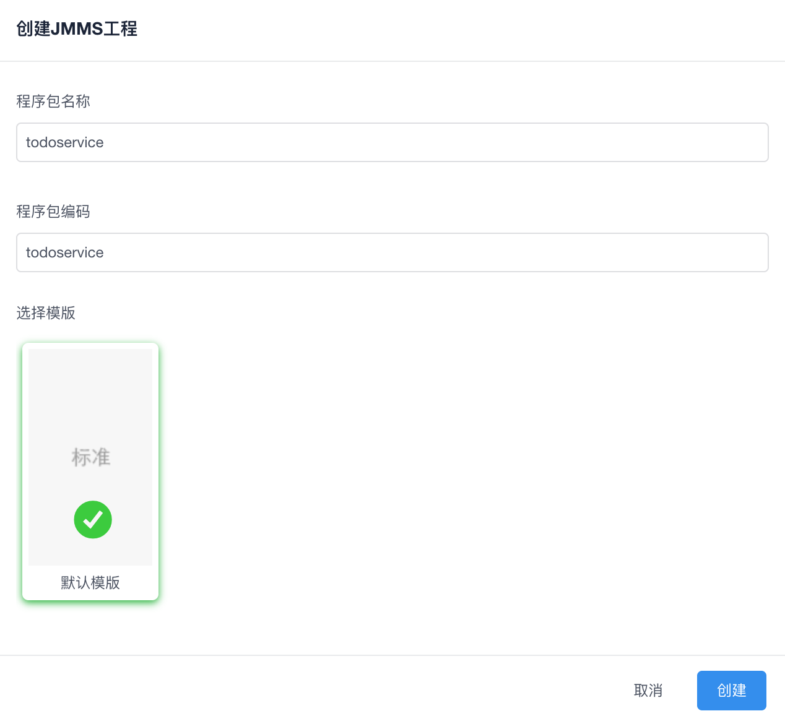
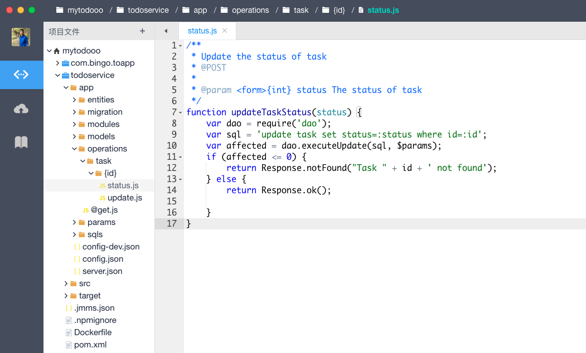
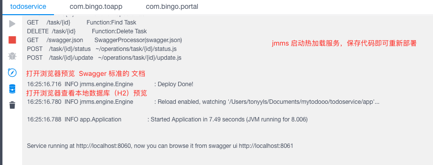
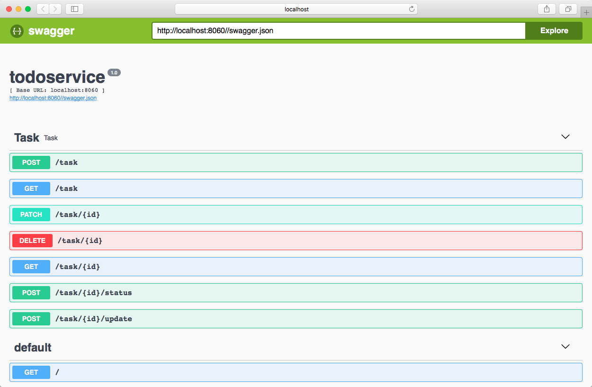
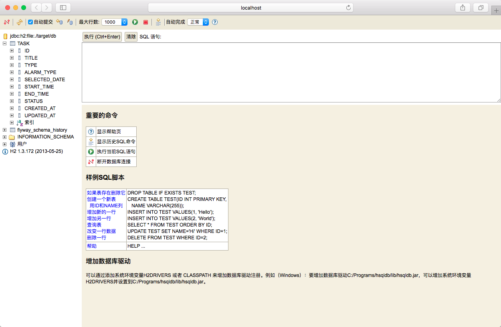

# API接口开发-jmms

[jmms](https://jmms-doc.github.io/)是一款标准的 `Restfull API`开发框架。基于jmms，开发人员可以使用 JS 脚本开发 API接口，同时快速生成 Swagger文档、MarkDown文档。

## 创建

## 编码

微服务的开发，可以基于 `js`,`sql`,`java` ，具体请看[开发文档](https://jmms-doc.github.io/)

## 运行服务

点击IDE 右下角【控制台】，选择对应的程序包工程

## 接口文档

IDE自动生成 Swagger 标准文档

## 本地数据库

IDE自动生成 H2 控制台

