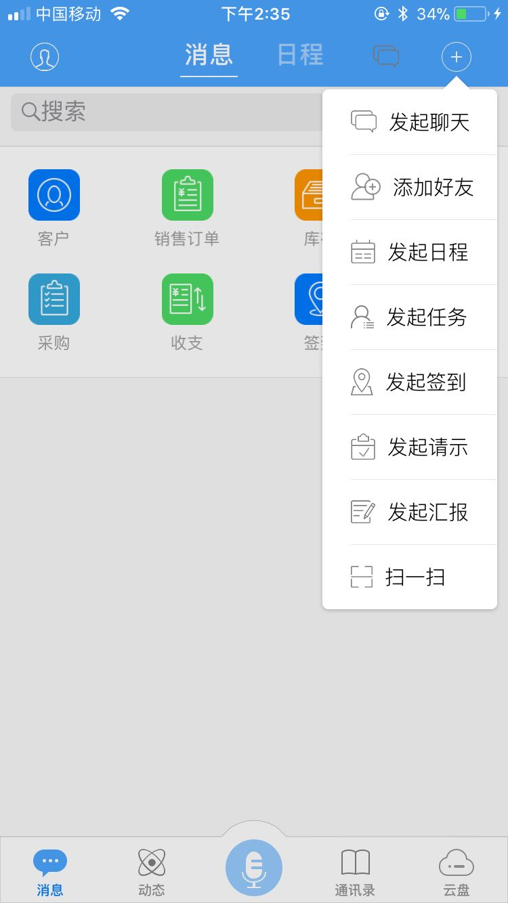
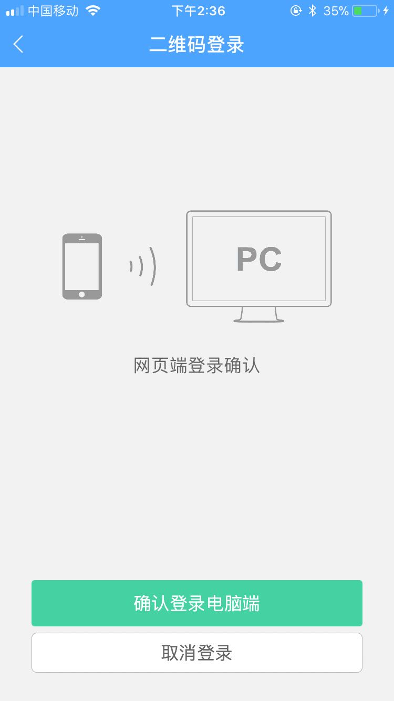

# 使用模式

开发者可以通过Link手机端扫码登录，登录后看到的项目应用信息来自交付平台。开发者也可以“跳过登录”直接使用IDE。

## 跳过登录

运行IDE，直接跳过登录即可，这种模式下将无法使用“一键部署”功能。

## Link登录

使用Link帐号登录IDE，进行项目 > 应用开发协作，最后可直接部署到 开发测试云。

**第一步：打开登录界面**

确保 Link 和 IDE 处在同一个局域网

**第二步：Link“扫一扫”并确认登录**

**第三步：登录成功**

