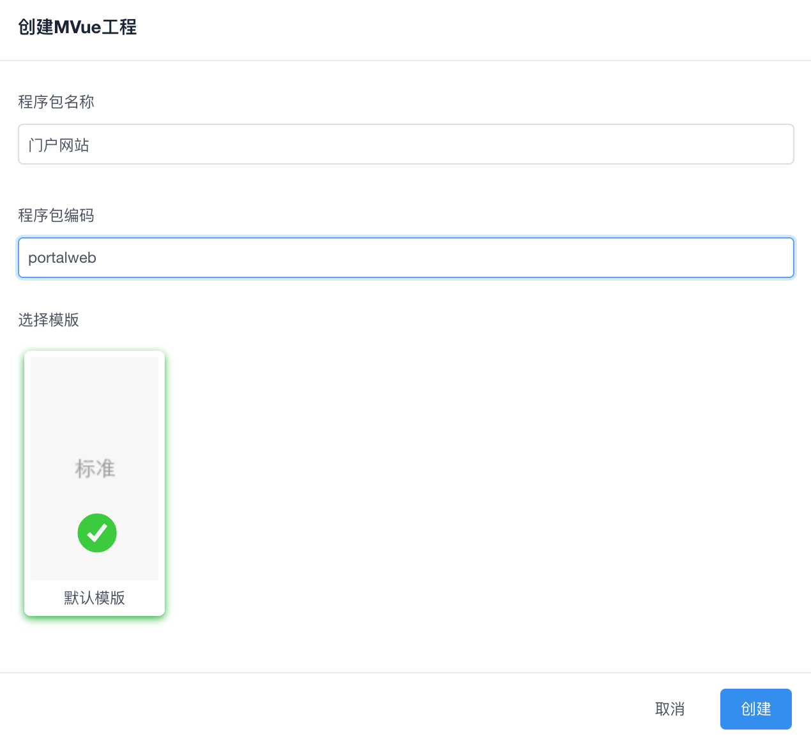
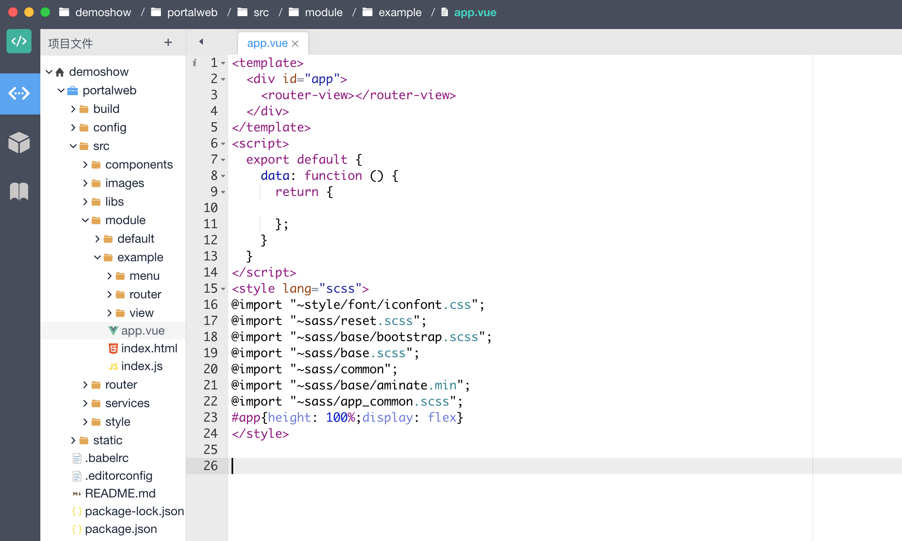
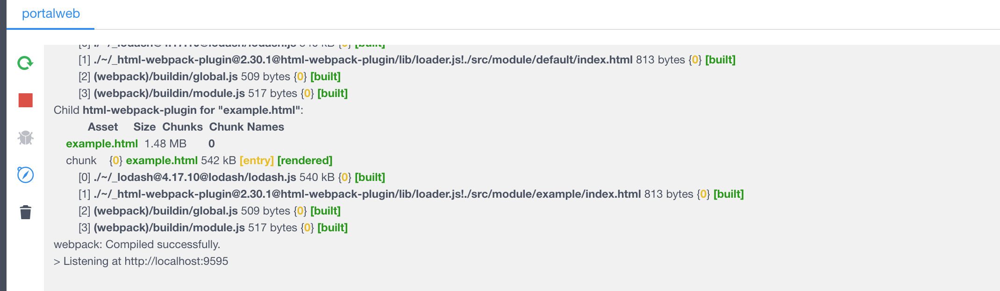
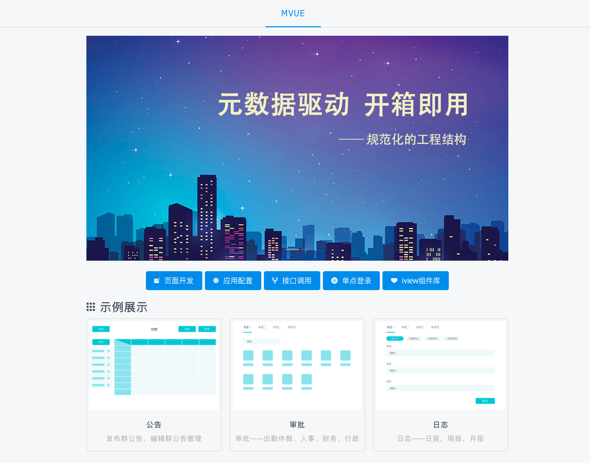

# Web轻应用开发-mvue

[mvue](http://dev.bingocc.com/mvue/)框架用于开发 Web轻应用，它是基于 Vuejs,iview,webpack等成熟的前端技术。mvue的核心思路是元数据驱动、开箱即用，通过定义后端的元数据信息，快速生成管理系统常用的列表、表单等界面。内置了 数据服务模块、单点登录模块等。

## 创建

## 编码

基于Vue,iview构建页面

## 运行服务

点击IDE 右下角【控制台】，选择对应的程序包工程

## 查看示例

