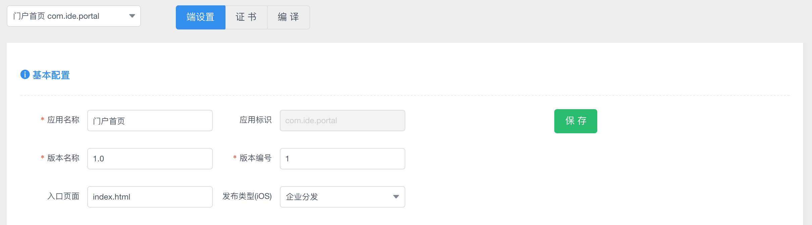
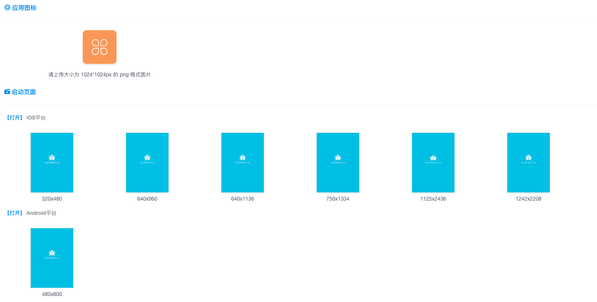
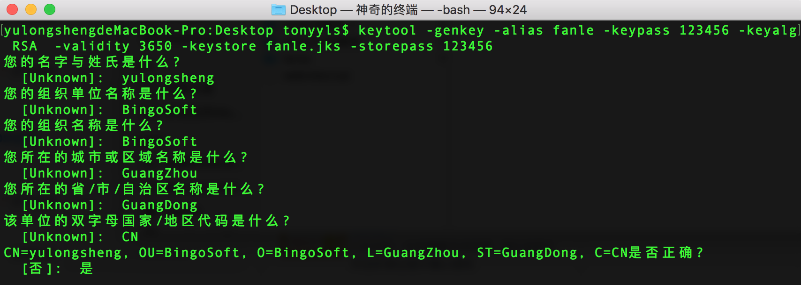
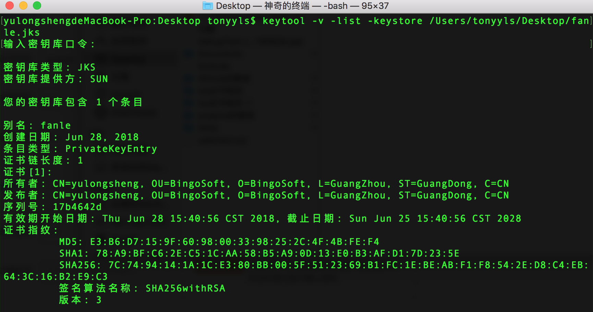
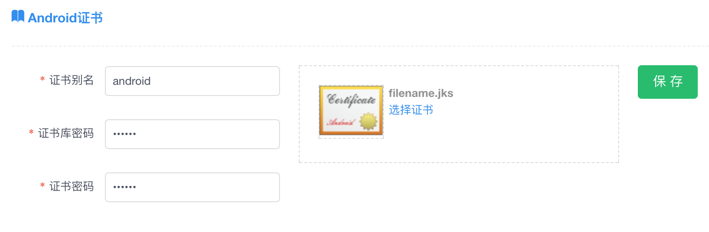
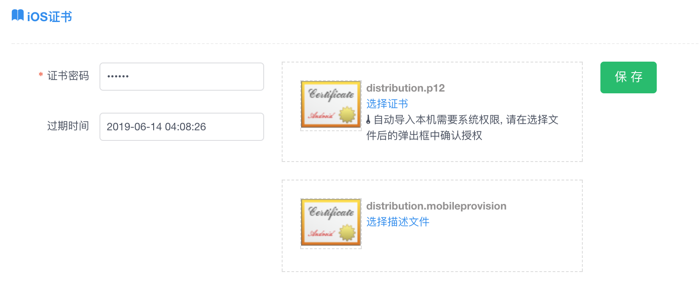
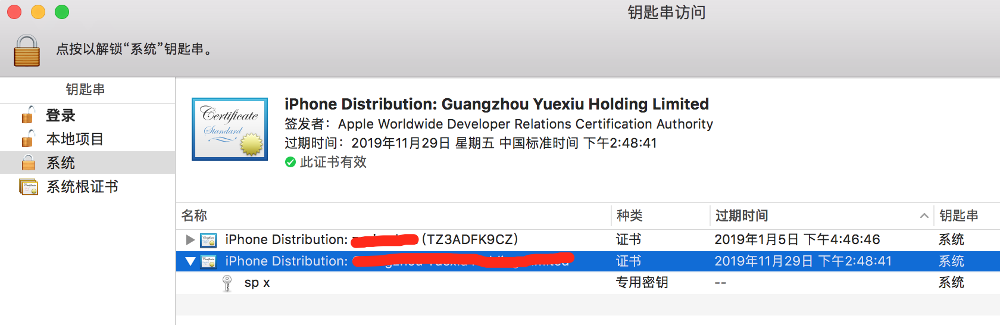
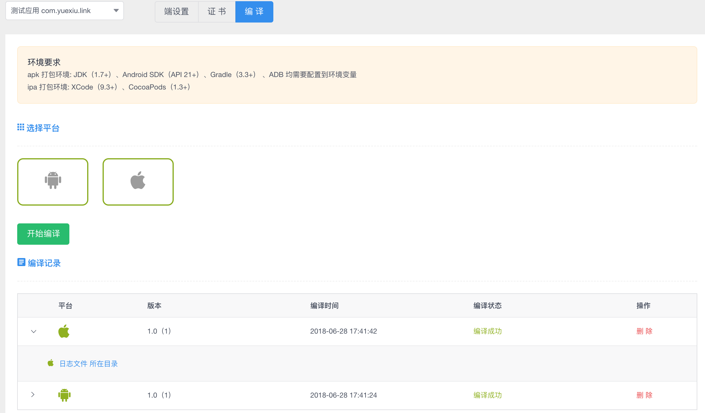

# APK/IPA打包

IDE支持将移动轻应用（BUI工程、小程序工程）打包成 Android（APK） 和 iOS (IPA)。 

## 打包环境

| 类型 | 系统环境 | 依赖工具 | 说明 | 
| :----: |:----|:----|:---|
| APK | Win、Mac | JDK(1.7+)、Android SDK(API 21+)、Gradle(3.3+) | JDK、Gradle、adb需要配置到环境变量 |
| IPA | Mac | XCode(9.3+)、CocoaPods(1.3+) | 确保在命令中能够使用`pod install`  | 

## 端设置

**基本配置**

* 应用名称：显示在桌面名字
* 应用标识：创建程序包的时候填写的，不能修改
* 版本名称：推荐格式:xx.x.x
* 版本编号：必须使用数字，例如 20180701
* 入口页面：应用打开时候加载的页面，BUI工程使用 \*.html 作为入口， 小程序工程使用 \*.weex.js 作为入口
* 发布类型(iOS)：跟 打包使用的证书有关，如果使用的是 企业证书($299)选择企业分发、公司或者个人($99)选择 AppStore。关于更多证书的细节，请参考 [苹果开发者计划](http://dev.bingocc.com/appleplan/)



**资源配置**

* 应用图标：上传大小为 1024 * 1024  png 格式的图片
* 启动页面：Android 和iOS 有不同尺寸的机型，按照提供的像素要求上传 png 格式图片




## 证书

### Android证书

jks 是一种证书格式，包含了密钥和密码，是android应用程序打包的必备文件，基于 keytool 来生成。

```bash
keytool -genkey -alias fanle -keypass 123456 -keyalg RSA  -validity 3650 -keystore 
fanle.jks -storepass 123456
```
* -alias 证书别名，示例中使用 fanle
* -keypass 证书密码 
* -storepass 证书库密码
* -keystore 证书存储路径



如果已经有了jks 文件，想要查看里面的内容，可以使用如下命令:

```bash
keytool -v -list -keystore jkspath
```



接下来将生成的jks上传，最后会上传到 `程序包/android/app.jks`



### iOS证书

[苹果开发者计划](http://dev.bingocc.com/appleplan/) 中提到，打包IPA需要 打包证书(p12)和描述文件(mobileprovision)。



上传的 p12 将会安装到系统的 KeyChain 中。



上传的 mobileprovision 将会安装到XCode中。


## 编译

选择对应的平台进行编译，编译成功可以打开目录找到文件，编译失败查看日志文件。

