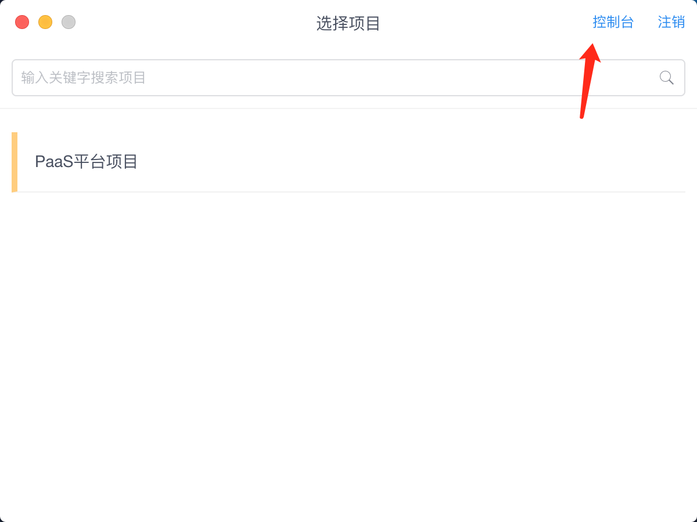
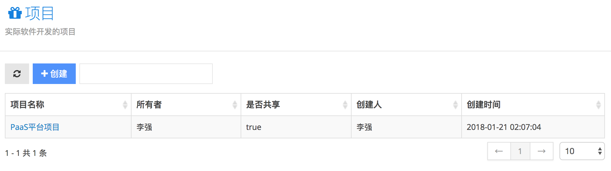
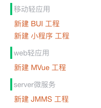

# 项目

使用Link帐号登录后，开发者会先选择项目。项目来自交付平台，由DevOps控制台统一管理项目。项目的创建不是在 IDE 中，需要联系管理员创建项目。

# 应用

通过IDE创建一个应用，这里的应用是指应用系统，里面可以包含多个程序包。例如做个日程应用，包含前端程序和后端服务程序。

### 创建应用

创建的应用，目录结构如下：

在这里相当于一个 Workspace ，其中 `*.linkspace` 记录了当前 工作目录的程序包数据。

### 选择应用

选择应用即可进入主面板！

### 主面板

# 程序包

IDE中支持创建4种类型的程序包工程，如下图：

* BUI工程：基于 web 技术构建移动轻应用
* 小程序工程：基于 weex 框架构建移动轻应用
* MVue工程：基于Vue.js 框架构建 PC web应用
* JMMS工程：基于动态语言(java)和脚本(js,sql)进行开发标准的 `Restfull API`

### 创建程序包

* 程序包名称：通常使用中文或者英文，不带符号，部署程序包的时候会显示出来
* 程序包编码：
	* BUI 和 小程序工程 ：要求格式 `com.xx.xx`
	* MVue 和 JMMS工程 ：要求格式 `todoservice` 不带标点
* 选择模版：每种类型程序包将会提供多种模版

程序包的详细信息会记录在 `*.linkspace`中。