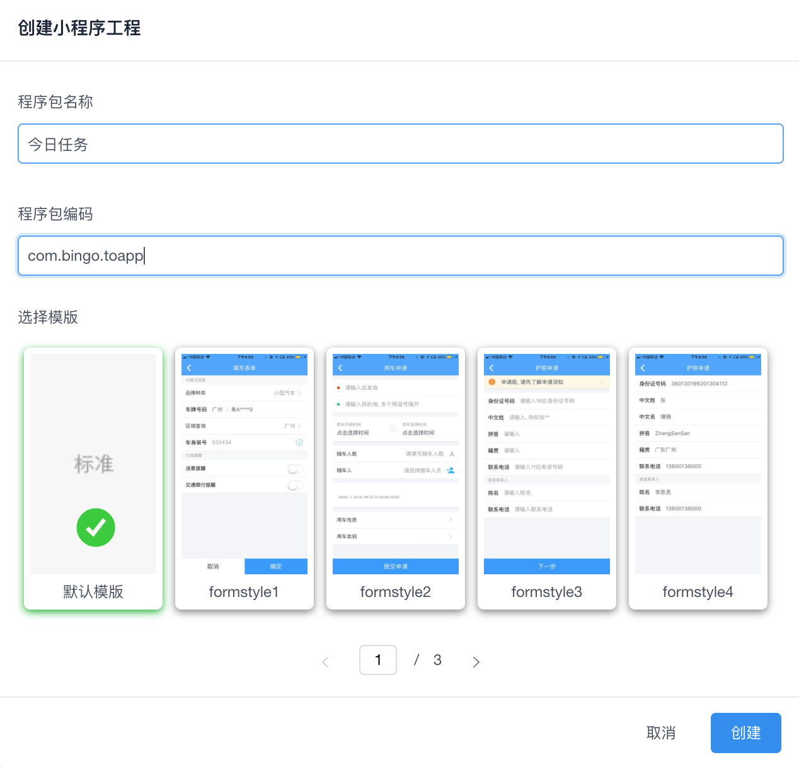
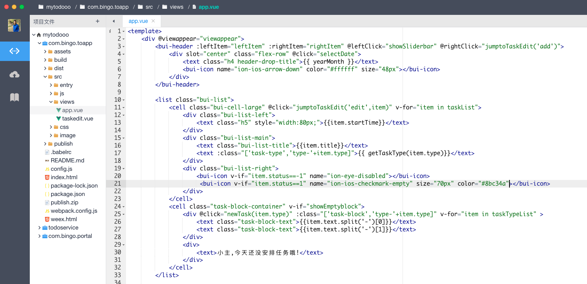
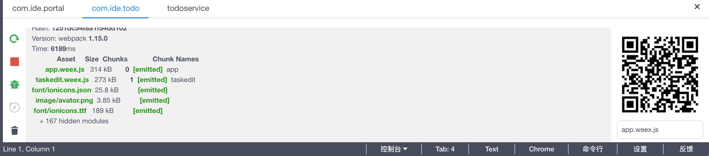
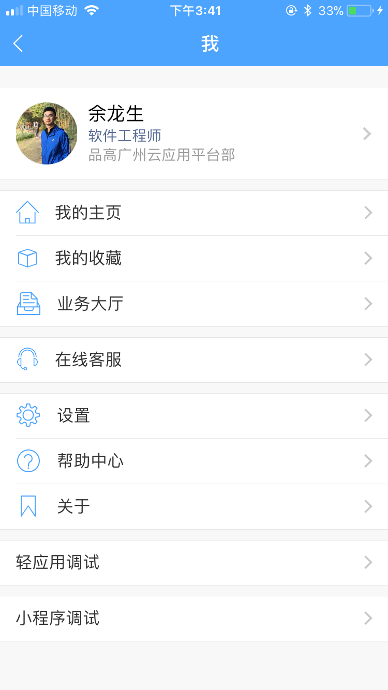
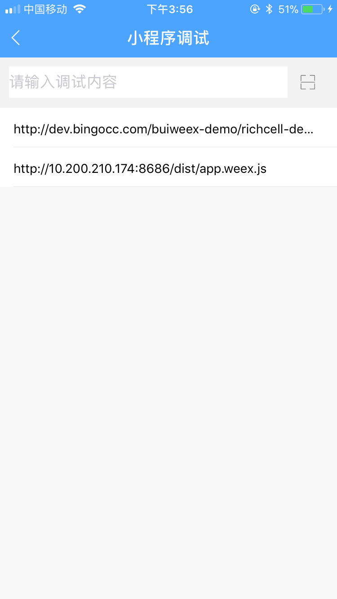
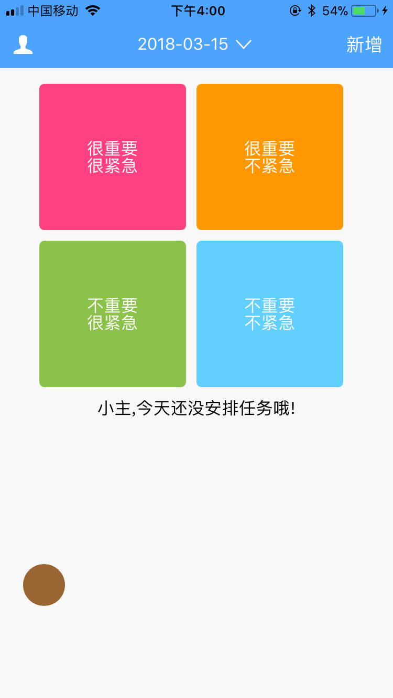
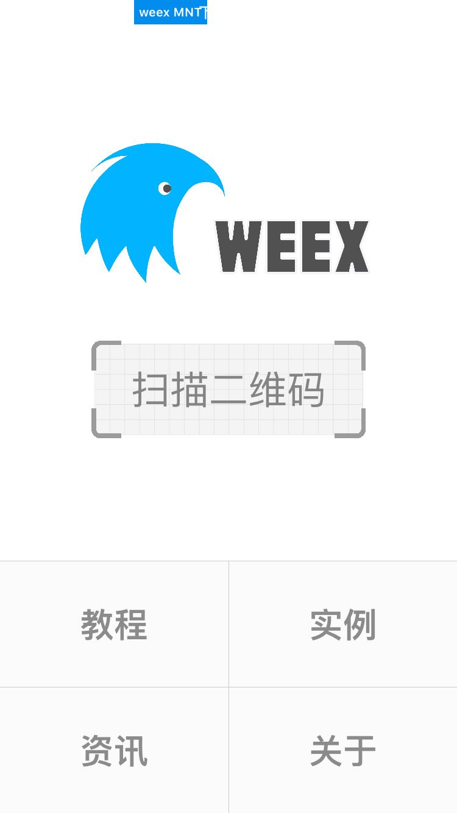

# 移动轻应用开发-Weex

[weex](https://weex-project.io/)是一套构建高性能、可扩展的原生应用跨平台开发方案，致力于使用 Web开发技术，使用同一套代码来构建跨平台应用。weex提供渲染引擎，语法解析引擎，开发者基于Vue、webpack、node技术体系构建应用，渲染出来的是原生组件，流畅性和体验上比webapp要好。目前的弊端是开发门槛较高。

| UI框架 | JSSDK | 调试工具 | 
| :----: |:----:|:----:|
| [BUI-Weex](http://dev.bingocc.com/buiweex/) | [LinkAPI JSSDK](https://www.npmjs.com/package/linkapi) | [Playground](https://weex-project.io/cn/tools/playground.html) |

应用开发流程： 创建 >  编码 > 运行 > 调试 > 打包

## 创建

## 编码

前端开发基于 [Vue.js](https://vuejs.org/) 框架

## 运行

点击IDE 右下角【控制台】，选择对应的程序包工程，正常启动后将会生成对应的二维码和启动调试服务。

## 调试

### 使用Link调试
手机端Link进入 “我”》“小程序调试”,扫描 IDE 右下角的二维码即可手机上查看页面效果。

注意：使用到LinkAPI的应用，需要在 Link中调试。

### 使用Playground调试

使用weex官方提供的调试工具，配合调试服务（也是基于Chrome的调试协议），可以查看页面结构、JS日志输出等。

