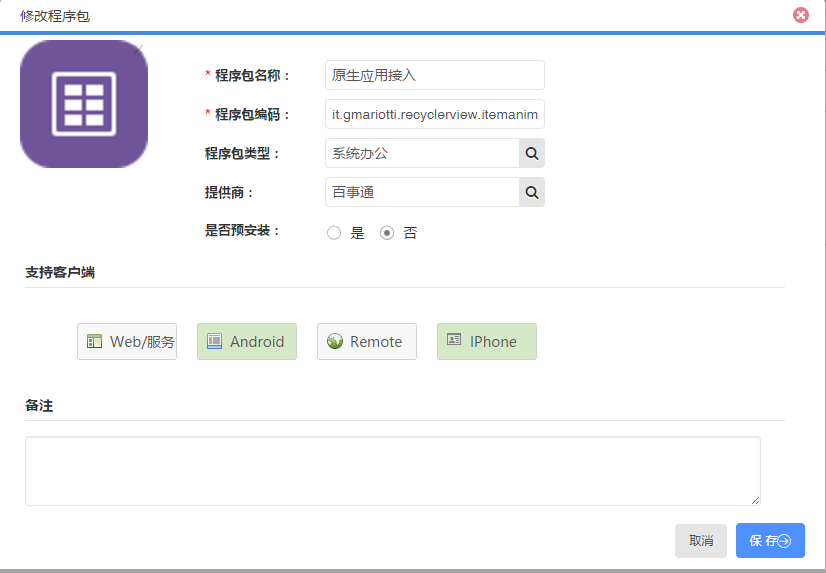
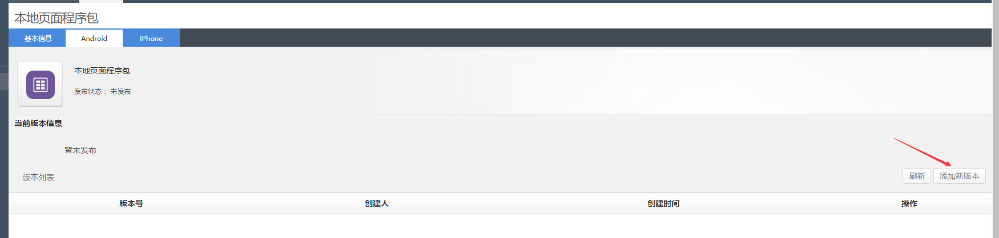
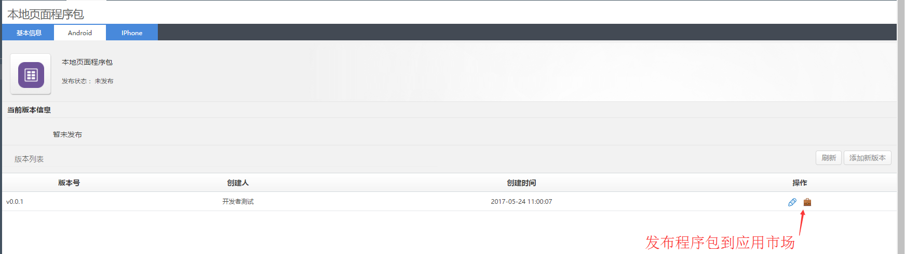
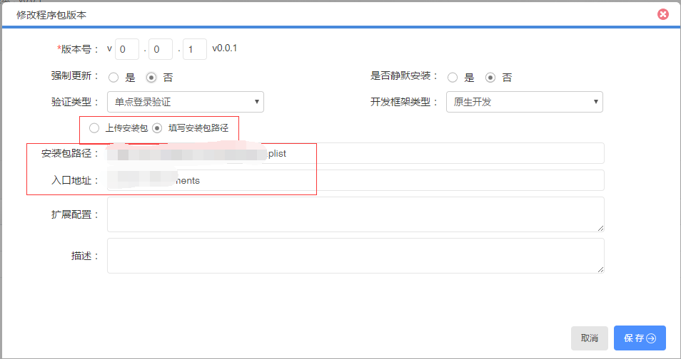
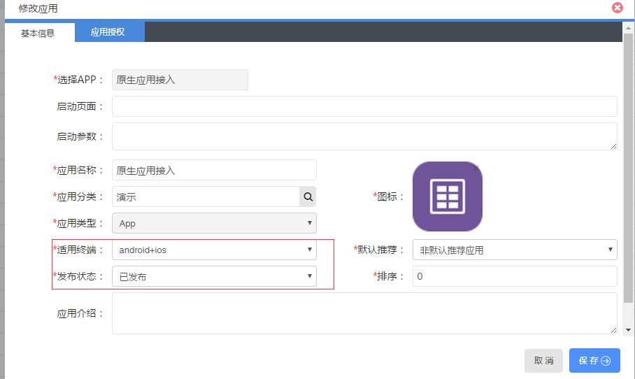
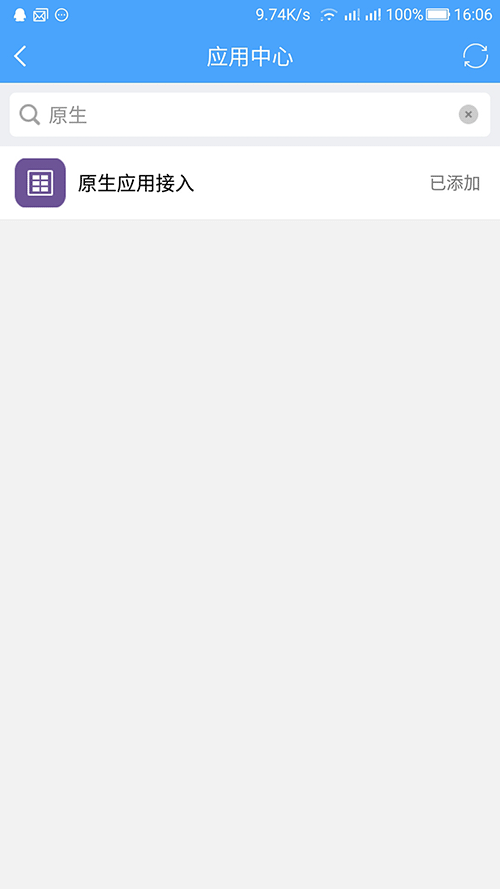

# 原生APP接入

> 在接入应用前，您首先要向管理员申请到 `应用管理` 的功能权限。

* 支持移动终端的应用

**接入原生应用步骤如下：**

* 开发原生应用
* 打包原生应用
* 创建并发布程序包
* 创建并发布应用

开发和打包原生应用的过程，请按照原生应用的方式开发和打包。

### 1. 打开程序包管理、创建程序包

登录聆客Web桌面，打开桌面上的程序包管理功能图标，点击新建按钮。

这里根据程序包支持的客户端选择，原生应用一般选择Android和IPhone。

这里的程序包编码必须和应用的唯一标识一致，安卓版和ios版的应用标识要保持一致。

保存即可创建成功。

输入应用基本信息：

> 注意：这里需要选择Android和IPhone客户端，移动端才能在link的应用市场中下载这个应用

* 是否预安装 ： 该应用在聆客里是否预加载安装

其他的根据需要自行填写。

在程序包管理列表中，找到刚刚创建的程序包，点击修改入口，此时可以看到顶部有三个标签：

* 基本信息：基本信息标签里设置权限 - 根据部门进行角色分配、注册应用身份 - 返回该应用标识的token，默认不选是返回link平台的token。
* Android：如下图。
* IPhone：这里我们以上传安卓程序包为例，IPhone的操作相同。

输入应用基本信息：

* 应用类型 ：应用的类型，原生应用接入的话，选择原生开发即可
* 安装包 ： 安卓安装包需要上传打包好的apk包
* 入口地址 ： 从link打开原生应用的时候，进入的Activite，可以不填，会打开apk的默认页面

这里上传的安装包目录结构如下：

点击保存后，可以看到在版本列表中就有刚刚上传的版本了。

### 2. 发布程序包
程序包上传完成之后，就可以发布了，在版本列表中：

发布IPhone程序包

IPhone的包和安卓不同，需要先发布到AppStore。然后找到应用在AppStore的下载地址。

在IPhone标签下，选择添加新版本：

* 应用类型 ：应用的类型，原生应用接入的话，选择原生开发即可
* 安装包 ： IOS不能直接上传安装包，目前只支持企业级应用开发，这里需要填写应用的plist地址
* 入口地址 ： 从link打开原生应用的时候，需要填写IOS应用的url scheme

### 3. 创建应用

登录聆客Web桌面，打开桌面上的应用管理功能图标。点击新建按钮，选择新建APP类应用。

### 6. 发布应用

适用终端选择android+ios，发布状态设置为已发布，点击保存即可。

在手机端的应用市场即可找到这应用：

