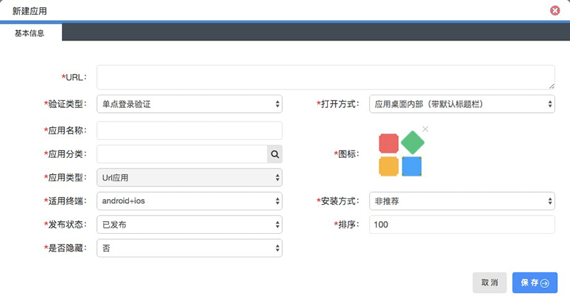
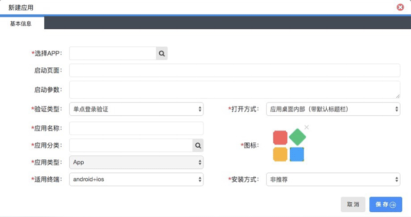

# 应用管理
前面讲述了有五种类型的应用，这里重点体现URL类、APP类这两种类型的应用。
### 创建新的应用

* URL类型应用

| 名称 | 类型 |  默认值 | 描述 |
| :----: |:----:| :----: |:----: |
| URL | 字符串 | | 远程地址 |
| 验证类型 | 选择类型 | 单点登录验证 | 只有URL类型的应用才选择单点登录验证 |
| 打开方式 | 选择类型 | 应用桌面内部（带默认标题栏）|  |
| 应用名称 | 字符串 | |  |
| 应用分类 | 选择类型 | | 把应用按类型分类 |
| 应用类型 | 选择类型 | Url应用 | Url应用 |
| 适用终端 | 选择类型 | android+ios | 标准web应用 |
| 发布状态 | 选择类型 | | 远程地址 |
| 图标 | 选择类型 | | 应用的图标 |
| 安装方式 | 选择类型 | 非推荐 | `非推荐`-应用在聆客的应用里是需要手动添加 `推荐安装`-应用在聆客的应用里是在推荐应用里体现 `强制安装`-应用在聆客的应用里是已经安装的应用 |
| 排序 | 字符串 | | 默认生成，不需要填写 |

* APP类型应用

| 名称 | 类型 |  默认值 | 描述 |
| :----: |:----:| :----: |:----: |
| URL | 字符串 | | 远程地址 |
| 选择APP | 选择类型 | | 选择已有的程序包 |
| 验证类型 | 选择类型 | 单点登录验证 | 选择不验证 |
| 打开方式 | 选择类型 | 应用桌面内部（带默认标题栏）|  |
| 应用名称 | 字符串 | |  |
| 应用分类 | 选择类型 | | 把应用按类型分类 |
| 应用类型 | 选择类型 | App | App |
| 适用终端 | 选择类型 | android+ios | android+ios |
| 图标 | 选择类型 | | 应用的图标 |
| 安装方式 | 选择类型 | 非推荐 | `非推荐`-应用在聆客的应用里是需要手动添加 `推荐安装`-应用在聆客的应用里是在推荐应用里体现 `强制安装`-应用在聆客的应用里是已经安装的应用 |

### 修改、应用授权
* `基本信息` : 创建应用时的信息修改
* `应用授权` : 应用根据部门进行角色分配

