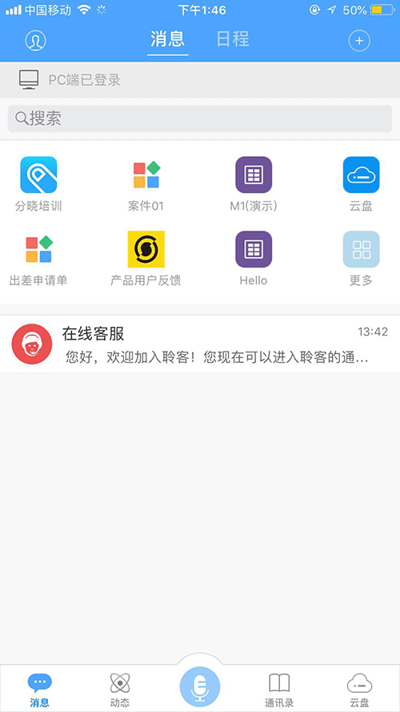
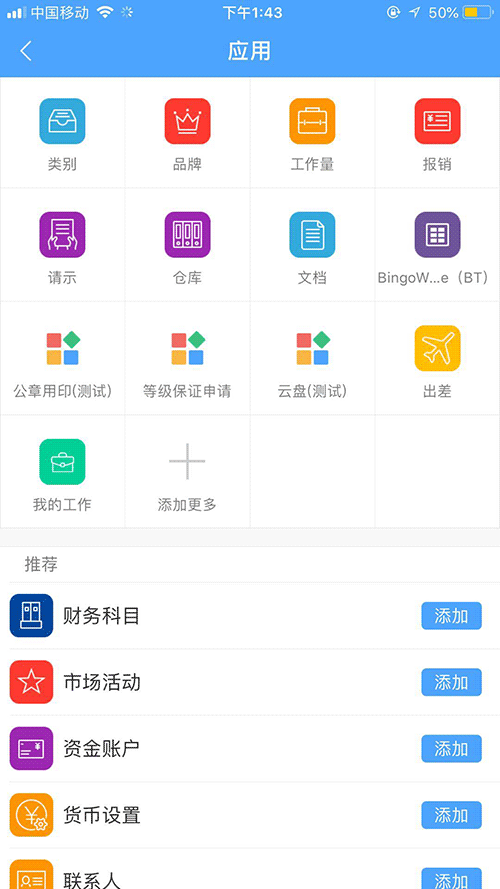
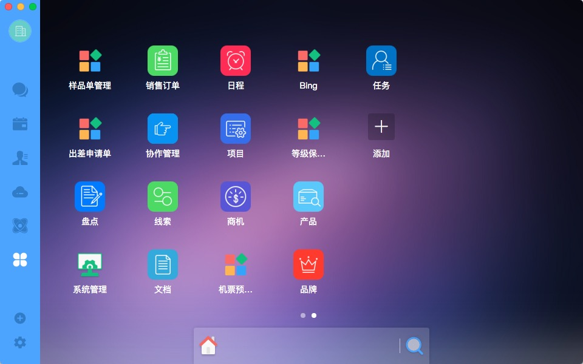
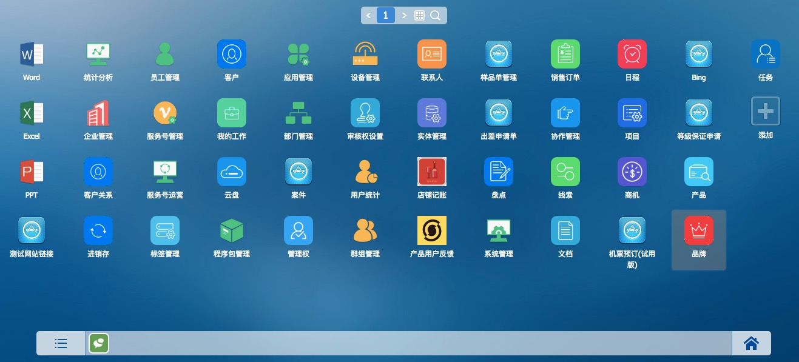

# Link应用接入

Link应用有五种类型，分别是：

* URL类 - 支持打开远程网页
* APP类 - 支持打开基于BT或者Weex开发的轻应用（仅移动端）
* 流程类 - 支持打开自由流程和固定流程
* 聊天类 - 支持打开Link内置的发起聊天功能
* 其他类 - 基础指令类应用，在以上种类不满足的情况下，可以通过基础指令打开（具体指令请咨询管理员）

## 移动端入口
首页推荐应用 、应用列表

 

## PC桌面入口

## webos入口

# 接入流程

在接入Link应用之前，首先您需要获取一个聆客中有开发者权限的账号，聆客分为公有云和私有云两个版本，公有云版在线注册账号即可使用，私有版本则需要联系私有聆客的管理员分配账号。

如果您不是为本企业的聆客开发应用，而是作为第三方开发者（或者开发商）为某个企业的聆客（包括公有和私有环境）开发并发布应用，我们建议采用以下流程：

* 申请一个在线聆客账号，在这个账号中进行体验甚至开发测试
* 如果该企业提供私有测试环境，拿到此环境的账号进行开发测试
* 发布应用时把应用信息或程序包提交给企业的应用管理员进行操作
* 使用该企业的测试账号或者由该企业的用户进行真实环境验测。

接下来的内容我们使用在线聆客的标准版本进行描述。

