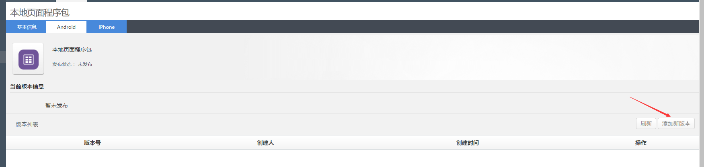
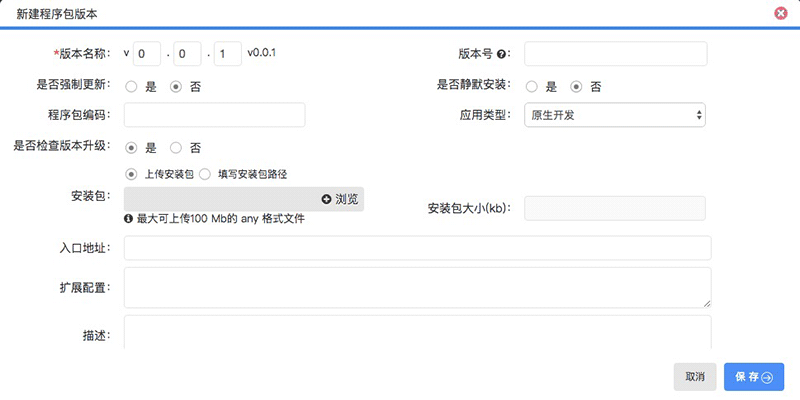
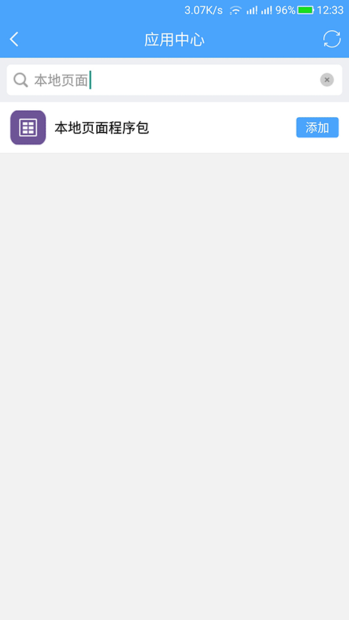

# 本地网页接入

> 在接入应用前，您首先要向管理员申请到 `应用管理` 的功能权限。

* 支持移动终端的应用

**本地网页接入的步骤如下：**

* 创建并发布程序包
* 打包网页程序
* 创建并发布程序包
* 创建并发布应用

### 1. 创建并发布程序包
开发好网页程序之后，我们需要将网页程序打成zip压缩包。

### 2. 打开程序包管理
登录聆客Web桌面，打开桌面上的程序包管理功能图标。

### 3. 创建程序包

点击新建按钮：

输入应用基本信息：

> 注意：这里需要选择Android和IPhone客户端，移动端才能在link的应用市场中下载这个应用

* 是否预安装 ： 该应用在聆客里是否预加载安装

其他的根据需要自行填写。

在程序包管理列表中，找到刚刚创建的程序包，点击修改入口，此时可以看到顶部有三个标签：

* 基本信息：基本信息标签里设置权限 - 根据部门进行角色分配、注册应用身份 - 返回该应用标识的token，默认不选是返回link平台的token。
* Android：如下图。
* IPhone：这里我们以上传安卓程序包为例，IPhone的操作相同。

输入应用基本信息：

* 安装包 ： 安装包就是我们的本地页面程序包，格式必须是zip压缩包
* 入口地址 ： 安装包解压后，进入程序时打开的页面，这个页面是相对于安装包根目录的路径

这里上传的安装包目录结构如下：

点击保存后，可以看到在版本列表中就有刚刚上传的版本了。

### 4. 发布程序包
程序包上传完成之后，就可以发布了，在版本列表中：

### 5. 创建应用

登录聆客Web桌面，打开桌面上的应用管理功能图标。点击新建按钮，选择新建APP类应用。

适用终端选择android+ios

发布状态选择已发布

> 注意：适用终端可以按照安装包实际发布的版本选择。

保存后这个应用即会发布到应用市场，在手机端添加应用搜索对应的应用名即可看到这个应用。

### 6. 发布应用

如果创建应用时，发布状态没有选择已发布，创建完成后可以重新修改应用，设置为已发布状态即可。

应用发布后可以在手机端搜索并安装这个应用:

