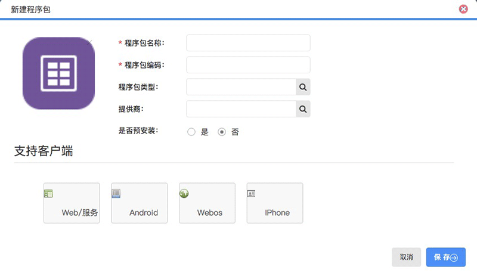
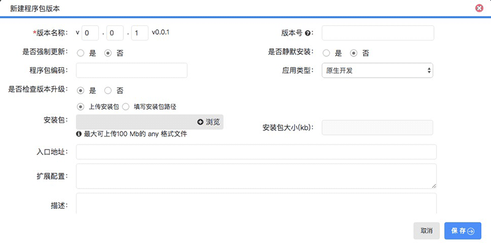

# 程序包管理

### 创建新的程序包

| 名称 | 类型 | 是否必填 | 默认值 | 描述 |
| :----: |:----:| :----: | :----: |:----: |
| 程序包名称 | 中英文即可 | 是 |  | 程序包名称 |
| 程序包编码 | 英文 | 是 | | 程序包的唯一标识 |
| 程序包类型 | 选择类型 | 否 | | 把程序按类型分类 |
| 提供商 | 选择类型 | 否 | | 程序包的提供商 |
| 是否预安装 | 选择类型 | 否 | 否 | 该应用在聆客里是否预加载安装 |
| 支持客户端 | 选择类型 | 否 |  | 该应用支持的客户端 |

### 修改、设置权限、注册应用身份
* `修改` ：修改程序包的基本信息
* `设置权限` ：根据部门进行角色分配
* `注册应用身份` ：返回该应用标识的token，默认不选是返回link平台的token。

### 上传程序包
入口是`修改`，选择对应支持的客户端上传对应用类型的程序包。具体操作如下图：

