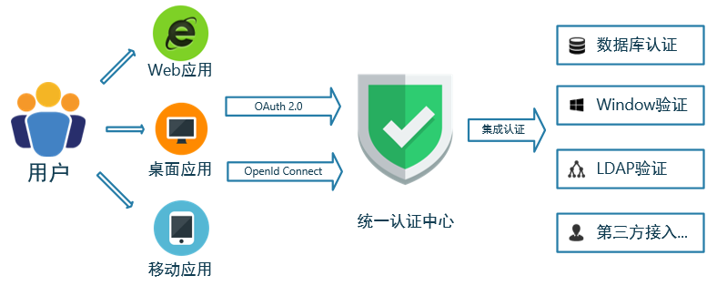
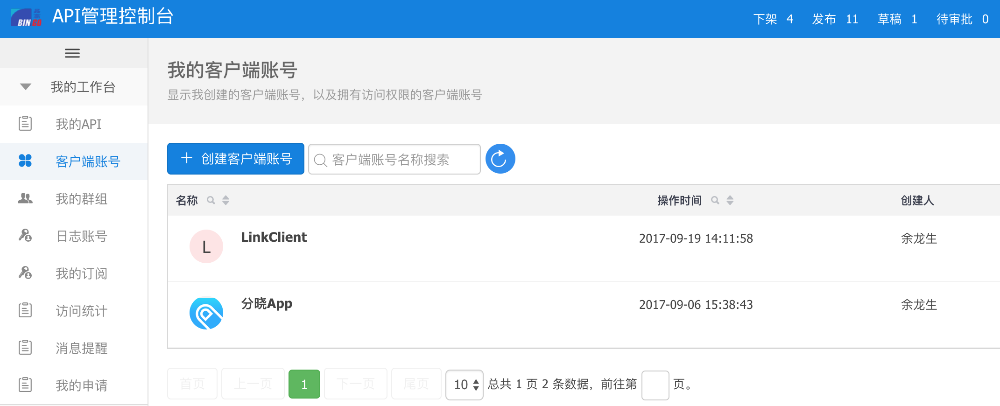
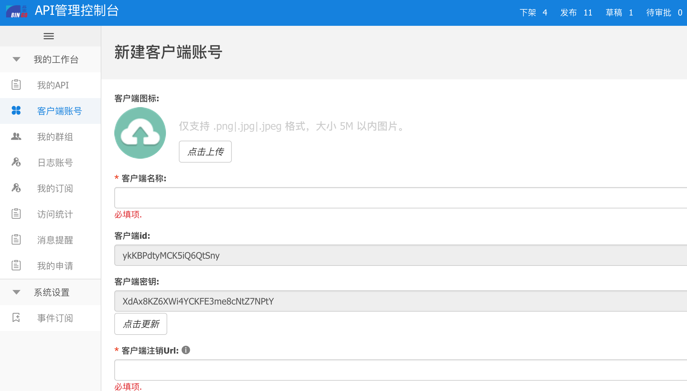

# 登录认证

统一认证服务为企业的应用开发提供通用的、单一的终端用户登陆接口，通过实施单点登录功能，用户只需一次身份认证，就可以对所有被授权的应用系统进行访问，二次登陆时无需重复输入密码，提高信息系统的易用性、安全性、稳定性。

更多相关协议和接口，请查看 [开放接口文档](http://dev.bingocc.com/ua/)

## 流程说明

获取客户端信息需要分四步：

第一步，成为平台开发者；

第二步，去API管理控制台创建客户端帐号（这里的客户端相当于应用）；

第三步，获取 clientId, clientSecret。

第四步，第三方系统集成SDK

## 创建客户端帐号

在企业级平台中应用是需要严格控制的，因此品高SSO要求每个应用都需要注册客户端帐号（获取客户端id`clientId`,客户端密钥`clientSecret`) 以便于企业IT管理员统一管控。注册客户端帐号需要在 【API管理控制台】。（试用客户请联系品高员工协助完成注册）。

创建客户端的界面如下：

根据指引完成客户端帐号注册，得到客户端id和客户端密钥，后续客户端集成SDK中会使用到这两个字段。

## 第三方系统集成SDK

第三方web系统集成统一认证服务流程请参考：[《接入流程》](http://dev.bingocc.com/ua/flow/)。

| 平台 | SDK | 
| :----: |:----:|
| JavaWeb | [《sso-client-java》](https://github.com/bingo-oss/sso-client) |
| Android | [《sso-client-android》](https://github.com/bingo-oss/linkopensdk-android) |
| iOS | [《sso-client-iOS》](https://github.com/bingo-oss/linkopensdk-ios) |
