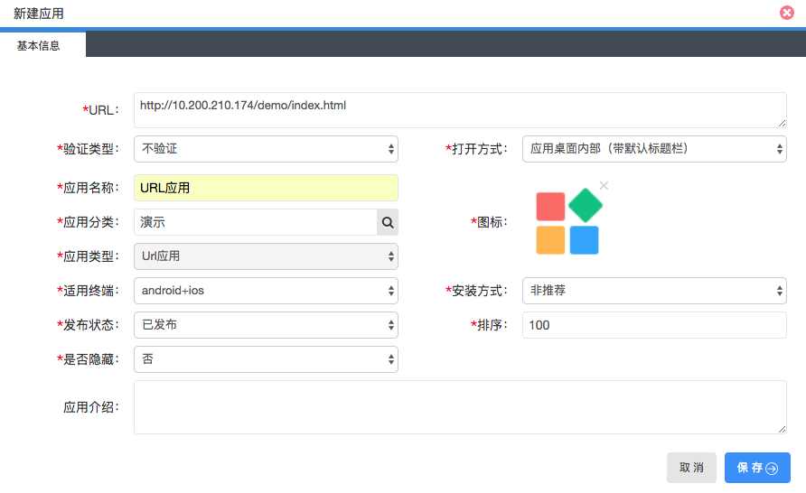
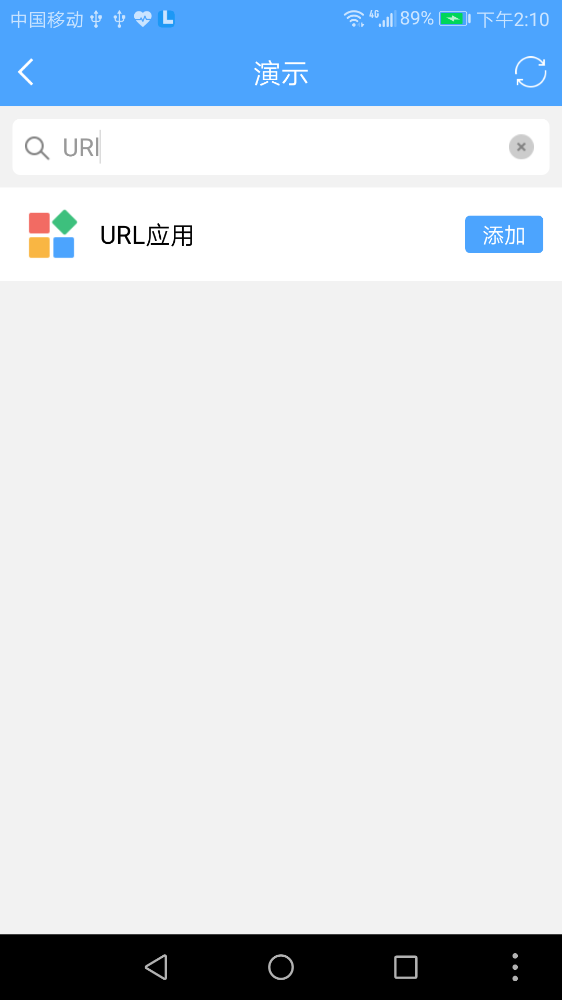

# 远程URL网页接入

> 在接入应用前，您首先要向管理员申请到 `应用管理` 的功能权限。

* 支持移动终端的应用
* 支持桌面、web终端的应用

### 1. 打开应用管理
登录聆客Web桌面，打开桌面上的应用管理功能图标。

### 2. 创建应用

点击新建按钮，选择新建URL类应用。

输入应用基本信息：

* URL ： 应用的访问地址
* 验证类型：是否需要接入单点登录（统一认证）
* 适用终端：选择android+ios 【支持移动端的应用】  |  标准web应用 【支持桌面、web终端的应用】
* 安装方式：非推荐。
 * `非推荐`-应用在聆客的应用里是需要手动添加
 * `推荐安装`-应用在聆客的应用里是在推荐应用里体现
 * `强制安装`-应用在聆客的应用里是已经安装的应用

其他的根据需要自行填写。

图一是支持移动终端的，图二是支持桌面、web终端的应用

### 3. 发布应用

在上一步的发布状态中选择已发布，保存应用后可以在手机聆客上看到刚才创建的新应用。

图一是支持移动终端的，图二是支持桌面、web终端的应用

