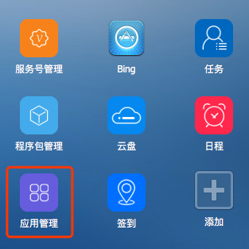
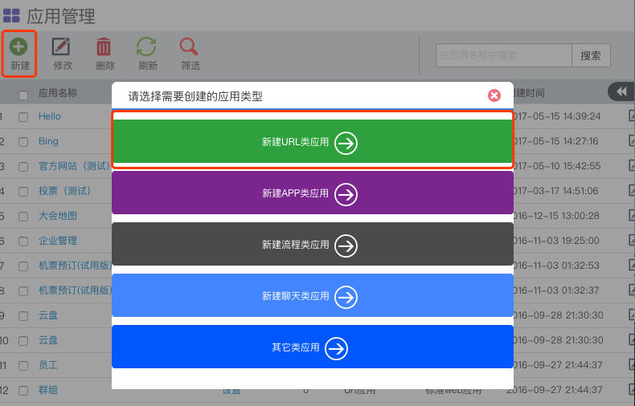
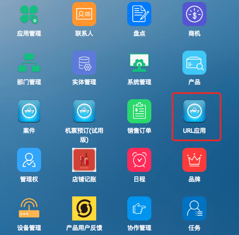

# 远程URL网页接入

> 在接入应用前，您首先要向管理员申请到 `应用管理` 的功能权限。

* 支持移动终端的应用
* 支持桌面、web终端的应用

## 1.打开应用管理
登录聆客Web桌面，打开桌面上的应用管理功能图标。

## 2.新建应用

点击新建按钮，选择新建URL类应用。

* URL ： 打开的目标地址（如果系统是部署成https的站点，这里填写的URL也需要是https的地址）
* 验证类型：是否需要接入单点登录（统一认证）
* 适用终端：选择android+ios 【支持移动端的应用】  |  标准web应用 【支持桌面、web终端的应用】
* 安装方式：
 * `非推荐`：应用需要手动添加
 * `推荐安装`：应用会出现在首页推荐里
 * `强制安装`：应用会出现在首页推荐里，并且不能移除

更多设置信息，请根据页面指引进行填写。

## 3.应用授权

新建的应用，可以根据部门、角色进行授权。

## 4.发布应用

在步骤3中的发布状态选择已发布，保存应用后可以在聆客上看到刚才创建的新应用。

